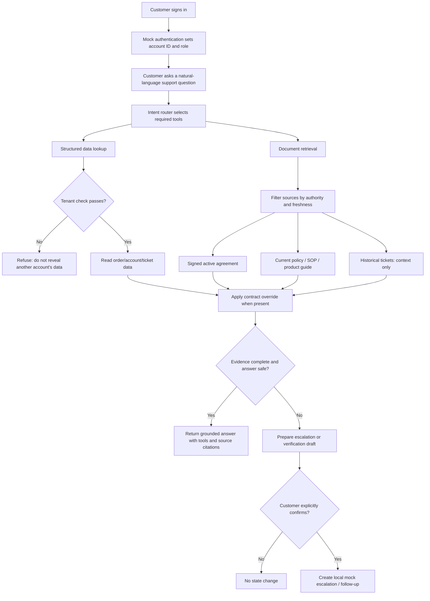
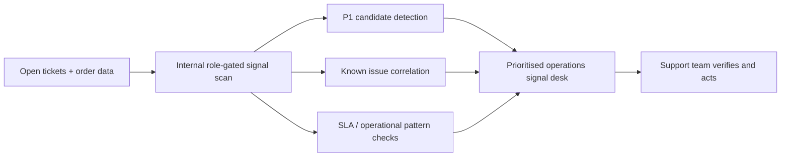

# ParcelPilot Project Workflow

## 1. Customer Support Request Workflow



### What happens in each step

1. **Authentication context** - The selected customer session creates an `AuthContext` containing the account ID. The agent does not obtain a tenant ID from the prompt.
2. **Intent routing** - The agent identifies whether the request is a cancellation, service-credit, known-issue, SLA, or escalation request.
3. **Tool execution** - It calls one or more tools: document search, scoped structured lookup/calculation, and (when needed) a state-action draft.
4. **Source reliability check** - The signed active agreement takes precedence over current operational documents. Deprecated policy v2 is excluded. Historical resolutions are never treated as authority.
5. **Decision** - The answer includes the applied rule, sources, and confidence. Unknown carrier fault, timing, or conflicting data creates a verification path instead of a promise.
6. **Action confirmation** - An escalation or credit follow-up is only drafted. The customer must press the separate confirmation button before the app records the local mock action.

## 2. Example: Northstar Cancellation

```mermaid
sequenceDiagram
    participant C as Northstar customer
    participant A as Support agent
    participant D as Scoped data tool
    participant R as Document retrieval tool
    C->>A: Can I cancel ORD-1001 without a fee?
    A->>D: Look up ORD-1001 for ACCT-001 only
    D-->>A: BOOKED, not picked up
    A->>R: Retrieve applicable cancellation rule
    R-->>A: Northstar signed agreement: fee waived before pickup
    A-->>C: Yes; explain contract override and cite source
```

## 3. Internal Proactive-Issue Workflow



The internal workflow is intentionally separate from the customer-facing chat. In production, it would require staff SSO/RBAC, durable alerting, and ticketing integration.

## 4. Submission Workflow

1. Run the application locally with `streamlit run app.py`.
2. Record the demo flow in the README (Northstar cancellation, LumenWorks service credit, SwiftShip delay, confirmation step, internal signals).
3. Push the repository to GitHub and deploy it on Streamlit Community Cloud or Render.
4. Add the repository URL, hosted URL, and demo-video link to the provided submission form.
